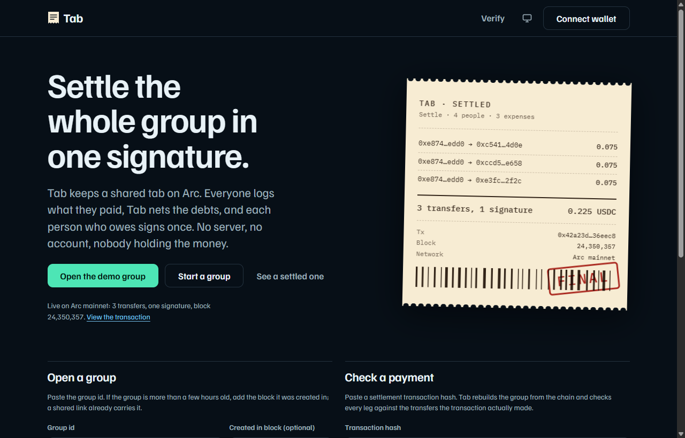
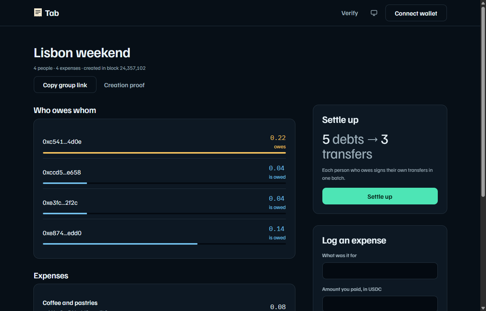
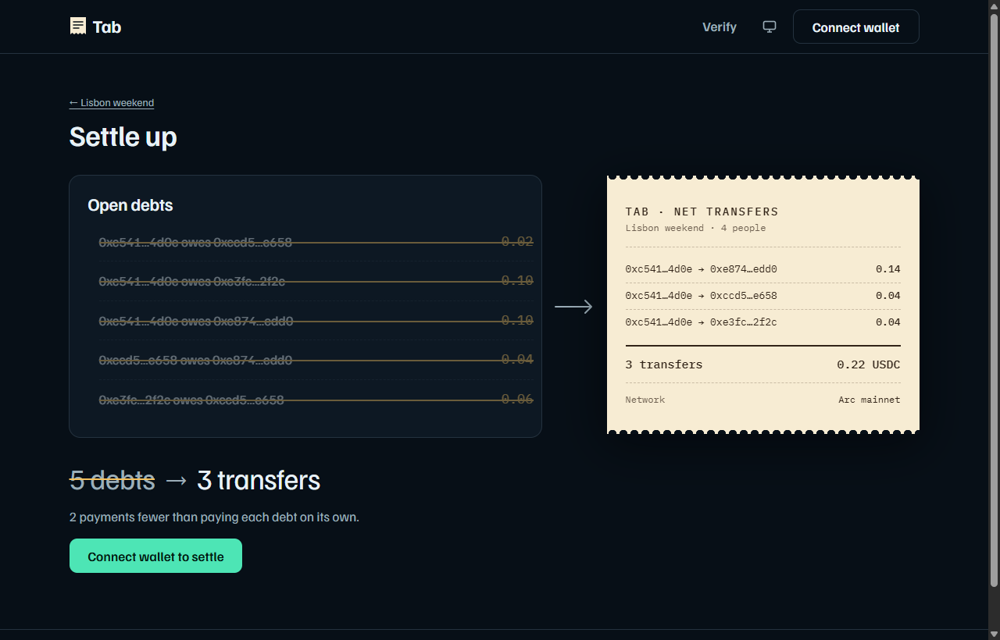
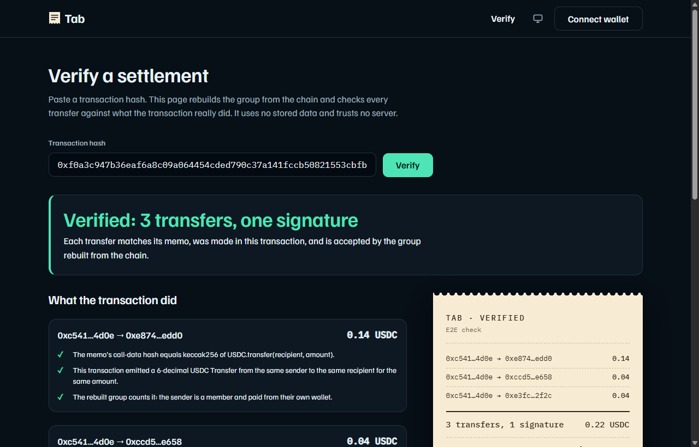
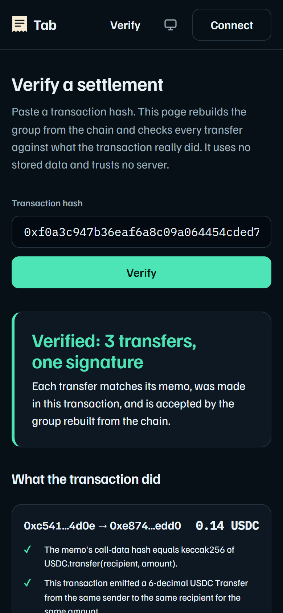

# Tab

A shared tab for a group of friends, kept entirely on Arc mainnet. Everyone logs what they paid. Tab nets the debts down to the fewest transfers. Each person who owes signs once, and every transfer in that signature carries its own on-chain memo.

There is no server, no database, no account system and no custody contract. The ledger is a set of `Memo` events that anyone can read, and the verify page rebuilds a group from a transaction hash alone.



## Status

| Item | Status | Where |
|---|---|---|
| Core library (money, split, netting, memo codec, ledger rules) | LIVE | `packages/tab-core`, 54 tests |
| Chain layer (reads, writes, settle batch, preflight, verify) | LIVE | `packages/tab-chain`, 29 tests plus 5 live-network tests |
| Web app, run locally | LIVE | `packages/tab-web`, 15 tests plus browser drives against mainnet |
| Settlement on Arc mainnet, 3 legs, one signature | LIVE | tx [`0xf0a3c947…63a4`](https://explorer.arc.io/tx/0xf0a3c947b36eaf6a8c09a064454cded790c37a141fccb50821553cbfb34463a4) |
| Hosted app | NOT LIVE | `https://juicewrld998.github.io/tab/` once GitHub Pages is switched on (see "Deploy") |
| npm packages | NOT LIVE | the two libraries are structured for it but not published |

Every claim in this README is mapped to a command or transaction in [CLAIMS.md](CLAIMS.md). The reasons behind each design choice, with the transaction that settled it, are in [DECISIONS.md](DECISIONS.md).

## Check it in two minutes, no wallet

You need Node 22 or newer and nothing else.

```sh
git clone https://github.com/JUICEWRLD998/tab.git && cd tab && npm install

# 1. Rebuild a real settlement from its transaction hash alone and check every leg.
npm run verify -- 0xf0a3c947b36eaf6a8c09a064454cded790c37a141fccb50821553cbfb34463a4

# 2. Read the open demo group straight from the chain: 5 debts, netted to 3 transfers.
npm run group -- tab-1h4j301v 24357102
```

The first command ends with `VERIFIED: 3 transfers, one signature.` and exits 0. It exits 1 for a transaction that does not verify, including a real `Memo` transaction that is not Tab's. The second prints the demo group's members, expenses and the netted plan.

To see the interface, run `npm run build:web && npm run preview:web` and open http://localhost:4173. Open the demo group, then press "Preview the netting". That page works without a wallet. To check a payment, open the Verify page and paste the hash above.

## What it uses Arc for

Tab is built from Arc's own predeploys. It would not work as written on a chain without them.

| Arc feature | Address | What Tab does with it |
|---|---|---|
| `Memo` | [`0x5294E992…e505`](https://explorer.arc.io/address/0x5294E9927c3306DcBaDb03fe70b92e01cCede505) | Every group action is a `Memo.memo(...)` call. The indexed `memoId` is `keccak256("tab:" + groupId)`, so one `getLogs` query returns a whole group. The event also stores the hash of the wrapped call, which is what lets the verifier prove a payment happened. |
| `Multicall3From` | [`0x522fAf9A…47D0`](https://explorer.arc.io/address/0x522fAf9A91c41c443c66765030741e4AaCe147D0) | Settlement is one `aggregate3` call whose legs are each `Memo.memo(USDC.transfer(...))`. `msg.sender` is preserved through both contracts, so the transfers leave the signer's own wallet and each leg still emits its own memo. |
| Native USDC and its 6-decimal ERC-20 interface | [`0x36000000…0000`](https://explorer.arc.io/address/0x3600000000000000000000000000000000000000) | Gas is paid in USDC, so a person needs one asset. All amounts are integer base units at 6 decimals. The 18-decimal native view and the system emitter's duplicate `Transfer` log are never mixed in (DECISIONS.md D3). |
| 20 gwei fee floor | protocol rule | Every transaction sets `maxFeePerGas` to at least 20 gwei. A 3-leg settlement used 140,891 gas, which is about 0.0028 USDC. |
| USDC blocklist | `isBlacklisted(address)` | A send to a blocklisted address burns gas without a receipt. Preflight checks every recipient and the signer before the wallet prompt. |
| Deterministic finality | protocol rule | A mined receipt is final, so the UI shows "Final" and no confirmation counter. |
| EOA-only callers | protocol rule | `Memo` and `Multicall3From` reject contract callers. The app checks `eth_getCode` after connecting and refuses a smart-contract wallet in plain words. |

## How it works

A group is a list of members, a series of expenses, and a series of settled transfers. All three are `Memo` events under one `memoId`.

```
  create group      Memo.memo(USDC, transfer(self, 0), memoId, groupMemo)       kind 3: name, members[]
  log an expense    Memo.memo(USDC, transfer(self, 0), memoId, expenseMemo)     kind 1: payer, amount, participants[], label
  settle            Multicall3From.aggregate3([
                      Memo.memo(USDC, transfer(to1, amt1), memoId, settleMemo1),   kind 2: from, to, amount
                      Memo.memo(USDC, transfer(to2, amt2), memoId, settleMemo2),
                      ...                                                          one leg per creditor
                    ])
```

Expenses and group creation wrap a harmless `USDC.transfer(self, 0)` so the memo has a call to attach to. A settle leg wraps a real transfer.

Reading is the reverse. The reader calls `getLogs` for the `Memo` topic and the group's `memoId`, in 5,000-block chunks, decodes each event, and applies the trust rules below in chain order. Balances come from folding expenses and settled legs. Netting is a greedy min-cash-flow match of the largest debtor to the largest creditor, which gives at most N-1 transfers for N people with a non-zero balance.

Each debtor signs their own batch. One signature can only move value out of the signer's wallet (DECISIONS.md D2 and D4). So the group's netted plan is split by debtor, and a debtor who owes three people still pays all three in one signature. In the demo group a single wallet owes everything, so one signature settles the whole group.

### Trust rules

Anyone can post a `Memo` under any `memoId`, so the ledger does not believe a memo just because it exists. A memo counts only if:

- It is a well-formed Tab memo. Foreign memo data under the same id is ignored.
- The first well-formed group memo, in chain order, defines the members, and its sender is one of them.
- Its sender is a member.
- An expense has `payer == sender` and only member participants.
- A settle leg has `from == sender`, both parties are members, the target is USDC, and the memo's `callDataHash` equals `keccak256(USDC.transfer(to, amount))`. A memo cannot claim a payment that the chain did not execute.

Each rule has a test that plays the attacker, in `packages/tab-core/test/ledger.test.ts` and `harden.test.ts`.

### Verify from a transaction hash

`verifyTx` reads one receipt, decodes every `Memo` log, and checks two things per settle leg from the receipt itself: the hash in the memo matches the transfer it names, and a 6-decimal USDC `Transfer` from the same sender to the same recipient for the same amount exists in the same transaction. Each transfer log can satisfy only one leg. It then rebuilds the group and confirms the rebuilt ledger accepts every leg. The verifier works from the `memoId`, because the hash of a group id cannot be reversed. The same function runs behind the Verify page and `npm run verify`.

## Proof on Arc mainnet

| What it shows | Transaction |
|---|---|
| First `Memo` event decoded, which fixed the event ABI | [`0x696f1765…b0ba`](https://explorer.arc.io/tx/0x696f1765e068c962a1cb8a8e7d21f74ad2d67ff8d97f2103528d179d83c8b0ba) |
| `msg.sender` survives `Multicall3From` and `Memo` to USDC | [`0x788a3abb…26e0`](https://explorer.arc.io/tx/0x788a3abbe97f603fdbd5d561d4d034e6022d6ae6a5e8c1ce7c9ed5d03c3f26e0) |
| A 3-leg settlement, one signature, a memo per leg (library run) | [`0x42a23d78…eec8`](https://explorer.arc.io/tx/0x42a23d78ca8e4ee7a16975b27d5c18ab303edb67359412aadc5f5b184936eec8) |
| The same settlement made through the web app by a browser wallet | [`0xf0a3c947…63a4`](https://explorer.arc.io/tx/0xf0a3c947b36eaf6a8c09a064454cded790c37a141fccb50821553cbfb34463a4) |
| Demo group `tab-1h4j301v`, created at block 24357102, left unsettled on purpose | [`0xd6703391…cf00`](https://explorer.arc.io/tx/0xd6703391692086af59c5bf07b58234af3678ebcaefba737320293d232a5cbf00) |

You can check any of them without Tab. For the settlement made through the web app:

```sh
cast receipt 0xf0a3c947b36eaf6a8c09a064454cded790c37a141fccb50821553cbfb34463a4 --rpc-url https://rpc.mainnet.arc.io
```

Expect `status 1`, `to` equal to the `Multicall3From` address, three `Memo` logs under one `memoId`, and three USDC `Transfer` logs of 140000, 40000 and 40000 base units, all `from` the same signer.

The wallets in these runs are throwaway keys generated for the build and funded with a few USDC. The creditors are other throwaway wallets of the same builder, so real value moved between wallets held by one person. Nothing here is a third party's money.

## Screens

| | |
|---|---|
|  |  |
| The demo group read live from the chain. | "Preview the netting" with no wallet: 5 open debts become 3 transfers. |
|  |  |
| The Verify page on the real settlement. | The same page at 390 px. |

## Tested how

```sh
npm test                                   # 98 tests, no network
LIVE=1 npx vitest run packages/tab-chain/test/verify.live.test.ts   # reads mainnet, no wallet
```

- Netting has 300 seeded random cases that check the balances sum to zero, the transfers zero every balance, there are at most N-1 legs, and no leg is zero or to oneself.
- The ledger has attacker tests: an outsider's expense, a forged payer, a leg whose hash does not match, a second group memo that tries to take over the member list, and a group memo that lists the zero address.
- The verifier has planted controls: no matching transfer, a wrong hash, one transfer claimed by two legs, the 18-decimal twin log, a foreign emitter, and a real Memo transaction that is not Tab's.
- Group sizes of 2 and 20 people with 300 expenses, one-unit dust spread over 20 people, and a 10^18 base unit expense all stay exact.
- The browser scripts in `packages/tab-web/scripts/e2e` drive the built app in headless Chrome over the DevTools protocol. `mainnet.mjs` creates a group, logs expenses from four wallets, rejects a signature, settles and verifies on mainnet. `harden.mjs` is read-only and runs 20 checks: an RPC that is down, an unknown group, a hostile group id, a transaction that is not Tab's, a contract wallet, the wrong network, a blocklisted recipient, and bad group forms.

## Security and trust model

- Tab never holds funds or keys. It builds transactions and the user's own wallet signs them. Funds move wallet to wallet.
- The app has no backend, so there is no server to compromise and no data to leak. Nicknames a user gives to members stay in that browser's local storage.
- Everything on chain is public. A group's name, members, amounts and labels are readable by anyone who knows or guesses the group id.
- A group id is not a secret and not an access control. The app generates ids like `tab-1h4j301v`, which are hard to guess. A hand-made id such as `lunch` could be claimed first by someone else, because the first valid group memo defines the members. Use the generated id.
- Every memo is checked against the rules above, so a stranger posting under your id cannot add an expense or a payment. They can post noise, which the reader skips and counts as rejected.
- A signed batch can only pay the legs shown on the settle screen, from the signer's wallet. The batch is simulated before the prompt.
- This code has not had an external audit. The hardening pass covered the wallet and write paths, and each rule above has a test. Treat it as a working prototype and use small amounts.

To report a problem, see [SECURITY.md](SECURITY.md).

## Known limits

- Without the creation block in the link, the reader scans backwards from the head, up to 400,000 blocks (about two days at the measured 0.5 s block time). Share links from the app carry the block. An old group needs it.
- The RPC rate-limits bursts. The reader keeps two requests in flight and retries. On a busy moment the page can take several seconds, and the browser console shows retry lines.
- Membership is fixed when the group is created. There is no edit, delete or removal of an expense. A mistake is fixed by a new expense that offsets it.
- The interface offers equal splits only. The library also supports custom shares.
- USDC only. EURC and other Arc assets are not wired in.
- Only a browser wallet that exposes `window.ethereum` is supported. When several wallet extensions are installed the browser picks one.
- The interface was checked with a scripted browser, an accessibility scan and a contrast and overflow sweep from 320 to 1920 px. Lighthouse (mobile emulation, local preview, 2026-10-05) scored the landing page 100 for accessibility, best practices, SEO and agentic browsing; a performance trace measured LCP 390 ms and CLS 0.01 with no network throttling. It has had no hands-on review on real phones, and the other routes were not run through Lighthouse.

## Roadmap

Not started:

- Publish `@tab/core` and `@tab/chain` to npm under a scope the author controls.
- Custom split shares in the interface.
- EURC groups.
- A share sheet with a QR code for the group link.

## Repository layout

```
packages/tab-core    pure TypeScript, no network: money, split, netting, memo codec, ledger rules, pairwise debts
packages/tab-chain   viem: Arc chain, log reader, write path, settle batch, preflight, guards, verifyTx
packages/tab-web     Vite + React + CSS Modules + motion/react app, browser drive scripts
scripts/             npm run verify, npm run group (terminal tools, read-only)
docs/img/            screenshots used here
DECISIONS.md         dated design decisions, each with the transaction or command that settled it
CLAIMS.md            every claim mapped to a command or transaction
```

Using the libraries from TypeScript:

```ts
import { groupMemoId, netTransfers } from "@tab/core";
import { findLedger, makePublicClient, verifyTx } from "@tab/chain";

const client = makePublicClient();
const { ledger } = await findLedger(client, groupMemoId("tab-1h4j301v"), { anchor: await client.getBlockNumber(), fromBlock: 24357102n });
const plan = netTransfers(ledger!.balances);            // at most N-1 transfers
const check = await verifyTx(client, "0xf0a3c947b36eaf6a8c09a064454cded790c37a141fccb50821553cbfb34463a4");
```

## Deploy

The app is static. `npm run build:web` writes `packages/tab-web/dist`, which any static host can serve, including a sub-path such as GitHub Pages (asset paths are relative and routes use the URL hash). `.github/workflows/pages.yml` builds and publishes it from `main`. Set `SITE_URL` at build time if you host it somewhere other than the default, so the social card image URL is correct.

## About

Built for the Arc Microgrants program by Mustapha Fadhlullah, independent security researcher. GitHub: [JUICEWRLD998](https://github.com/JUICEWRLD998). MIT licensed, see [LICENSE](LICENSE).
